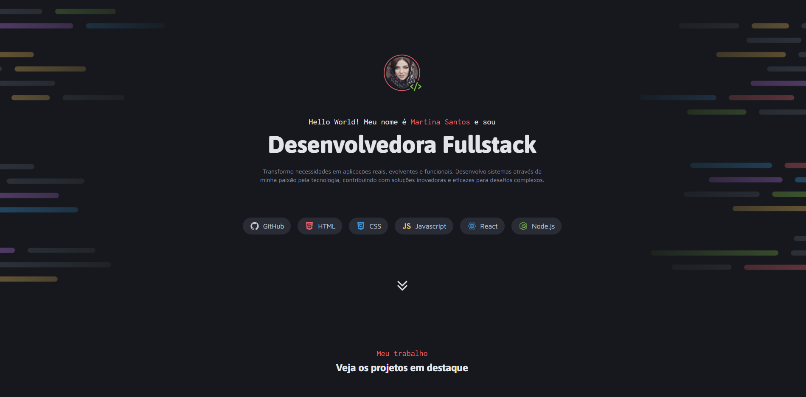

# Portfólio | Desenvolvedora Fullstack

🎯 Este projeto é um portfólio profissional criado para apresentar minhas habilidades, experiências e projetos como desenvolvedora frontend. Através dele, demonstro como aplico a tecnologia para resolver problemas reais, criando soluções modernas, funcionais e intuitivas.

<p align="center">
  
</p>

🔗 **Acesse aqui:** [nikolasmarlon.github.io/Portfolio-dev](https://nikolasmarlon.github.io/Portfolio-dev/)

---

## ✨ Funcionalidades

- Apresentação profissional com layout moderno e responsivo
- Seção com projetos em destaque
- Descrição dos serviços oferecidos (Web, APIs, DevOps)
- Contato com links para redes sociais e e-mail
- Navegação suave com foco em UX

---

## 🚀 Tecnologias Utilizadas

- 
- 

---

## 📸 Imagem de Exemplo

<p align="center">
    
<p>

---

## 🛠️ Como rodar este projeto localmente

```bash
# Clone o repositório
git clone https://github.com/nikolasmarlon/Portfolio-dev.git
